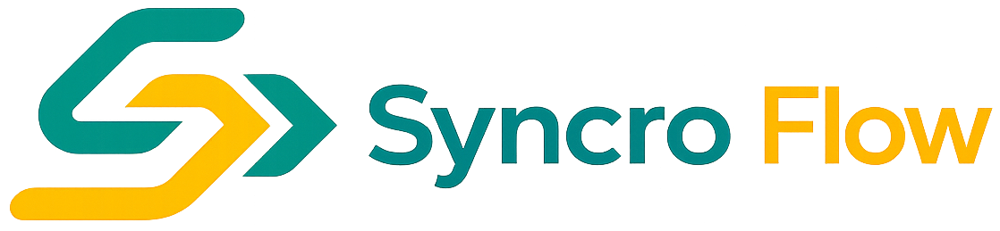

<div align="center">



# Syncro Flow — V12

### Kanban estratégico em um único arquivo HTML


</div>

---

## Descrição

**Syncro Flow** é um sistema de gestão estratégica no formato Kanban, entregue em **um único arquivo HTML** com persistência em `data.json` local. Foi projetado para times pequenos e médios que querem visibilidade sobre projetos, prazos, responsáveis e ganhos quantitativos — sem precisar instalar servidor, configurar banco ou subir nada na nuvem.

Indicado para: squads de TI, equipes de simplificação/processos, células de melhoria contínua, e qualquer projeto pessoal que se beneficie de um quadro Kanban com dashboard, Gantt, calendário e rastreio de ganhos.

---

## Tecnologias

- **HTML5** semântico
- **CSS3** com variáveis customizadas, Grid e Flexbox (8 temas: 4 claros + 4 escuros)
- **JavaScript** ES2020 vanilla — zero dependências, zero frameworks
- **Persistência via `.json` local** usando a [File System Access API](https://developer.mozilla.org/en-US/docs/Web/API/File_System_Access_API) (leitura + escrita direta no disco)
- **Hash de senha** com Web Crypto API (SHA-256, client-side)

---

## Como usar

1. **Clone o repositório**
   ```bash
   git clone https://github.com/SEU-USUARIO/syncro-flow.git
   cd syncro-flow
   ```

2. **Abra o arquivo `index.html` diretamente no navegador** (não requer servidor).
   - **Chrome** ou **Edge** (86+) → modo edição completo.
   - Outros navegadores (Firefox, Safari) → modo somente-leitura.

3. **Na primeira execução**:
   - A tela de login pede usuário + senha.
   - Selecione a aba **Criar conta** e preencha usuário, nome e senha.
   - Selecione a pasta onde está o `data.json` (botão **Selecionar pasta**).
   - O **primeiro usuário cadastrado vira admin (TI) automaticamente**.

4. **Próximos acessos**: aba **Entrar**, usuário + senha, selecione a pasta novamente (o navegador pede permissão a cada sessão por segurança).

> **Credenciais padrão**: o `data.json` é publicado **vazio**. Não há usuário pré-cadastrado — você cria o primeiro admin na tela de cadastro. Para criar usuários manualmente, veja a próxima seção.

---

## Estrutura de usuários (JSON)

Os usuários ficam em `data.json` dentro do objeto `users`, indexados pelo **username** (chave de string única):

```json
{
  "users": {
    "joao.silva": {
      "name": "João Silva",
      "role": "analista",
      "passwordHash": "<sha-256 hex da senha>",
      "jobTitle": "",
      "department": "",
      "reportsTo": null,
      "trophies": [],
      "profileTitle": null,
      "totalLogins": 0,
      "createdAt": "2026-01-15T10:00:00.000Z",
      "loginHistory": [],
      "color": "",
      "seenAchievements": []
    }
  }
}
```

### Campos obrigatórios

| Campo          | Descrição                                                                     |
|----------------|-------------------------------------------------------------------------------|
| `name`         | Nome de exibição (aparece em cards, atividade, perfil)                        |
| `role`         | Papel/permissão — ver tabela abaixo                                           |
| `passwordHash` | SHA-256 hex da senha. Gerar com `await sha256Hex("minhaSenha")` no console    |

Os demais campos são populados automaticamente pelo sistema.

### Adicionando usuários manualmente

```javascript
// Abra o DevTools do navegador (F12) na aba Console e rode:
await sha256Hex("senhaDoUsuario");
// → copie o hex retornado e cole em "passwordHash" no data.json
```

Depois é só salvar o `data.json` e recarregar a página.

### Níveis de permissão

| Role          | Capacidades                                                                |
|---------------|----------------------------------------------------------------------------|
| `ti`          | Admin completo. Gerencia usuários, papéis, manutenção, configurações.      |
| `gestor`      | Cria/edita cards, aprova entregáveis, vê painéis de equipe.                |
| `analista`    | Cria/edita seus próprios cards e comenta nos demais.                       |
| `visitante`   | Somente leitura. Não pode editar cards nem comentar.                       |

O primeiro usuário cadastrado é promovido a `ti` automaticamente. Demais cadastros entram como `visitante` e devem ser promovidos pelo admin (na aba **Equipe**).

---

## Funcionalidades principais (V12)

- **Quadro Kanban** com drag-and-drop, swimlanes, filtros, limites WIP por coluna.
- **Dashboard** com KPIs, throughput, distribuição por responsável, prioridade e visão.
- **Calendário** mensal e semanal de entregas.
- **Gantt** com timeline de início e entrega.
- **Meu Painel** — visão pessoal: cards do usuário, prazos, conquistas, burndown.
- **Equipe** — administração de usuários, papéis e histórico de mudanças.
- **Gamificação** — 89 troféus e títulos desbloqueáveis baseados em ações reais.
- **Rastreamento de ganhos** — horas/mês, horas/ano, economia financeira e tags qualitativas por card.
- **Subtarefas, dependências e comentários** por card.
- **Lock otimista** anti-conflito entre múltiplos usuários no mesmo `data.json`.
- **8 temas visuais** (4 claros + 4 escuros) com persistência em `localStorage`.
- **Exportação CSV** dos projetos.
- **Backups automáticos** versionados dentro do `data.json`.
- **Snapshots semanais** e performance mensal por usuário.
- **Modo manutenção** controlado pelo admin.

---

## Histórico de versões

### V12 (atual)
- Refatoração para uso open source / portfolio.
- **Novo fluxo de autenticação**: tela de login com **usuário + senha** (hash SHA-256 via Web Crypto API) em substituição ao auto-preenchimento por path do navegador.
- Primeiro usuário cadastrado é promovido a admin automaticamente.
- Removido o módulo de configuração de **Equipe e contato** da aba **Sobre** (campos `teamName`, `contact`, `docsUrl` deprecados em `data.json`).
- Branding genérico: paleta de cores neutra (`teal` + `amber`), chaves `localStorage` migradas para o prefixo `syncro_kanban_*`.
- Variáveis internas renomeadas: `valeId` → `userId`, `lastModifiedByValeId` → `lastModifiedByUserId`.
- `data.json` zerado preservando schema completo (24 chaves de topo).
- README reescrito.

### V10.x (anterior)
- Versão corporativa interna. Identificação por matrícula de 8 dígitos extraída do path do Windows. Substituída na V12.

---

## Estrutura de arquivos

```
syncro-flow/
├── index.html        ← Aplicação completa (HTML + CSS + JS)
├── data.json         ← Banco de dados (vazio por padrão)
├── Logomarca.PNG     ← Logo na sidebar e tela de setup
├── icon.PNG          ← Favicon
└── README.md         ← Este arquivo
```

---

## Contribuindo

A aplicação inteira vive em `index.html` (~21 mil linhas). Use `Ctrl+F` para navegar — as seções são delimitadas por comentários do tipo `/* ===...=== */`.

```bash
git checkout -b feature/minha-melhoria
# edite o index.html
git commit -m "feat: descrição"
git push origin feature/minha-melhoria
```

Sem build, sem npm, sem servidor — abra no navegador e itere.

---

## Licença

[MIT License](LICENSE). Uso livre para projetos pessoais e comerciais.

---

## Desenvolvedor

Desenvolvido por **Aurelio Gabriel**.
